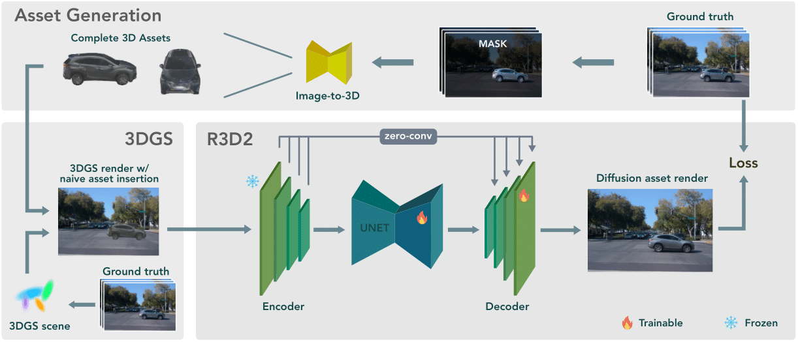

<p align="center">
    <!-- project badges -->
    <a href="https://research.zenseact.com/publications/R3D2/"></a>
    <!-- paper badges -->
    <a href="">
        
    </a>
</p>

<div align="center">
<h4 align="center">R3D2: Realistic 3D Asset Insertion via Diffusion for Autonomous Driving Simulation</h4>

<p align="center">
  
</p>

[Project page](https://research.zenseact.com/publications/gasp/)  ·
[About](#about)  ·
[TODOs](#todos)

</div>

<h4>Code to be released.</h4>

## About
This is the official repository for _R3D2: Realistic 3D Asset Insertion via Diffusion for Autonomous Driving Simulation_.

## Abstract
Validating autonomous driving (AD) systems requires diverse and safety-critical testing, making photorealistic virtual environments essential. Traditional simulation platforms, while controllable, are resource-intensive to scale and often suffer from a domain gap with real-world data. In contrast, neural reconstruction methods like 3D Gaussian Splatting (3DGS) offer a scalable solution for creating photorealistic digital twins of real-world driving scenes. However, they struggle with dynamic object manipulation and reusability as their per-scene optimization-based methodology tends to result in incomplete object models with integrated illumination effects. This paper introduces R3D2, a lightweight, one-step diffusion model designed to overcome these limitations and enable realistic insertion of complete 3D assets into existing scenes by generating plausible rendering effects—such as shadows and consistent lighting—in real time. This is achieved by training R3D2 on a novel dataset: 3DGS object assets are generated from in-the-wild AD data using an image-conditioned 3D generative model, and then synthetically placed into neural rendering-based virtual environments, allowing R3D2 to learn realistic integration. Quantitative and qualitative evaluations demonstrate that R3D2 significantly enhances the realism of inserted assets, enabling use-cases like text-to-3D asset insertion and cross-scene/dataset object transfer, allowing for true scalability in AD validation.


## TODOs
- [ ] Release code
- [ ] Release dataset
- [ ] Release pre-trained models

## Citation
If you find this work useful, please consider citing:
```bibtex
@article{ljungbergh2025r3d2,
  title        = {R3D2: Realistic 3D Asset Insertion via Diffusion for Autonomous Driving Simulation},
  author       = {Ljungbergh, William and Taveira, Bernardo and Zheng, Wenzhao and Tonderski, Adam and Peng, Chensheng and Kahl, Fredrik and Petersson, Christoffer and Felsberg, Michael and Keutzer, Kurt and Tomizuka, Masayoshi and Zhan, Wei},
  journal      = {},
  year         = {2025}
}
```